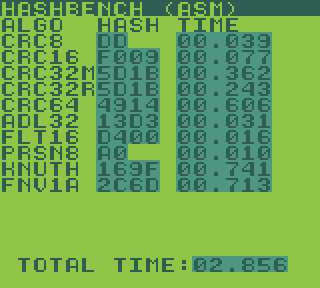

# Hash-bench-gb (asm)



A hashing algorithm benchmark test ROM for the Gameboy and Gameboy Color. Directly inspired by dmang-dev's [hash-bench-gb](https://github.com/dmang-dev/hash-bench-gb/). This is a complete rewrite from scratch of the hashing algorithms in assembly language, to see how fast they can go if they're allowed to go wroom. While the algorithms are reimplemented manually by me in asm, I've looked at dmang-dev's c code as a reference. Although his project is MIT, and this is MIT, so it should be fine copyright wise. The point of using their code as a reference is to simplify my life since I'm not intimately familiar with most of these hashing algorithms, but also to ensure that the benchmark is somewhat an apples to apples comparison. I'm using some minor speed tricks, like loop unrolling, storing variables in HRAM and page aligned buffers. But I don't want to win the speed race by implementing the algorithm in a completely different way, like using a lookup table when the original benchmark used a bit by bit approach for example. Although that's all up for interpretation.

Included is also a log of my findings while writing the hashing algorithms for people enjoy that kind of yapping. 

## Introduction

Much like dmang-dev's original project was an exercise in benchmarking old hardware, so is this one. But it is as much an exercise in comparing c and assembly language on the target hardware. On modern CPUs, an optimizing c compiler will outsmart the asm programmer in 9 cases out of 10. On ancient hardware, not so much. The reason seems to largely be that it has resource constraints that don't favor the compiler. Yes, the compiler can (theoretically) figure out how to compile any program in a systematic step by step way, however each step potentially has a lot of overhead, which will be discussed briefly in the analysis below. The asm programmer is free to choose the way their data is represented, while the c compiler has more rigid data formats that it needs to work through systematically.

## TODO!

This is still an early release just to get this thing out to the world so it doesn't stay locked up forever. There's still a lot of things that are not complete or need to be cleaned up.

- Most hashes are not implemented yet, especially the crypto ones. Those will be a real pain to do in asm, but I want to get to it some day soon.
- The code is a mess and a lot of things would need refactoring. For example moving the hash functions to their own files. The hashes are doing ugly things like using the hash buffer for loop counters with direct pointer arithmetic. Solve this better using `union`s or something.
- Any kind of actually interactive UI. Can't rerun the sweep or select double speed GBC mode for example. Would like to add a UI to inspect the full hash. 
- The seconds timer currently doesn't print the high byte of the seconds (>255 seconds). It also prints the low byte as heex instead of decimal. I'll change that when any time measured in the test comes close to taking 10 seconds, hehe.

## AI disclosure

The log parser script (`tools/parse_log_data*.py`) was generated using Claude AI. The initial prompt is included for anyone curious, although more changes were made later for which the prompt was not posted. This is only required for an optional workflow which is not required to run or build the main benchmark ROM.

All other code and documentation in this project was made by my human mind and hands without any AI assistance.

## Building

Prerequisite: RGBDS, preferentially v0.6.1 as newer versions very likely having breaking syntax changes. Under Linux and presumably macOS, just run `./m.sh`. Under Windows, run `m.bat`. No Makefile, sorry. 

## Download

If you are just looking for the ROM, go to [releases](https://github.com/nitro2k01/hash-bench-gb-asm/releases/).

## Test results

These are the test results of the algorithms implemented so far, as well the corresponding result for the original Hash-bench-gb project. 

| Hash        | ASM result (mine) | C result (original) | Notes on the result |
| ----------- | ----------------- | ------------------- | ----- |
| CRC-8       | 39 ms             | 268 ms   | 6.87x faster. |
| CRC-16      | 77 ms             | 268 ms   | 3.48x faster. |
| CRC-32      | 362 ms / 243 ms   | 1076 ms  | 4.43x faster. The slower time is a variant placing the hash state in RAM and the faster time places it in registers. |
| CRC-64      | 606 ms            | 5726 ms / 2762 ms | 9.45x / 4.56x faster. CRC-64 was omitted from the original Hash-bench-gb test. I added it back in out of curiosity. The second faster result is an optimized c version that doesn't rely on the `Hash-bench-gb` data type. See commentary below.
| ADL-32      | 31 ms             | 165 ms   | 5.32x faster. |
| Fletcher-16 | 16 ms             | 1358 ms / 109 ms  | 84.9x(!) / 6.8x faster. 1358 ms seemed like an abnormally slow speed for this algorithm. I made a simple optimization that made it 10x faster. See commentary below. |
| Fletcher-32 |                   | 398 ms   |  |
| Pearson-8   | 10 ms             | 54 ms    | 5.40x faster. |
| Knuth-mul   | 741 ms            | 1318 ms  | 1.78x faster. |
| Jenkins OAT |                   | 381 ms   |  |
| PJW/ELF     |                   | 448 ms   |  |
| SDBM        |                   | 473 ms   |  |
| DJB2        |                   | 362 ms   |  |
| FNV-1a 32   | 713 ms            | 1306 ms  |  |
| Murmur3-32  |                   | 1323 ms  |  |
| xxHash32    |                   | 854 ms   |  |
| MD4         |                   | 912 ms   |  |
| MD5         |                   | 1942 ms  |  |
| SHA-1       |                   | 2076 ms  |  |

## Timing methodology

### How the test ROM measures time

This is a potential shortcoming I identified in the original project, which really seems to come from the standard GBDK runtime environment I guess. It's using the frame counter for timing, which gives a ±0.5 frames or ±8 ms jitter. I wanted something better. I chose to use the timer and timer interrupt of the GB. Because of the GB's binary clock frequency (4.19 Mhz or 4\*1024\*1024 Hz master clock) everything fits nicely into essentially a binary counter. The timer interrupt is set up to trigger at 256 Hz and increment a software timer. After 256 counts, which (by design) is when a byte counter overflows, the second counter is incremented. The 256 Hz timer is created by setting the prescaler to the 16 kiHz (16384 Hz) mode, and the modulo is set to divide the prescaled clock by 64 (in normal speed) or 128 (in double speed). The current timer value can be read out and added to the fractional precision. This means an additional 6, 7 bits of precision for a total of 14-15 bits of precision for the fractional second value. Effectively, the timing measurement has a precision of 61 microseconds which, even with measurement jitter, is well below the displayed precision of milliseconds. Therefore, there was no need to repeat fast hashes multiple times to increase the accuracy. 

However, this does mean that interrupts may not be disabled for more than ~3.9 ms (1/256 s) or interrupts will be missed. 

The seconds counter is 16 bit, allowing for a 65536 seconds or over 18 hours to be counted. 

### Ground truth time measurement using a debugger

I wanted to check the precision of the presented values in the original project, as well as sanity check my own measurements. To this end I used the BGB debugger's debug message support, which can display the internally measured number of clock cycles.

To produce a log, add two breakpoints, one immediately before the hash runs and one immediately after. The first one resets BGB's internal clock counter as prints the value of the `HL` register, which in this case holds the test address. The seconds breakpoint prints the time taken for the test. The following addresses and debug messages can be used for the v1.0.0 release of the hash-bench-gb project:

```
PC=1:6F63
Debug msg:%ZEROCLKS%%HL%
PC=1:6F64
Debug msg:%LASTCLKS%
```

For my project, you can use label definitions made for the purpose if the sym file is loaded. The ROM also includes builtin debug messages which could be used in BGB to the same effect.

```
PC=perform_test_sweep.gt_before_test
Debug msg:%ZEROCLKS%%HL%
PC=perform_test_sweep.gt_after_test
Debug msg:%LASTCLKS%
```

Command line options for the log file aprser tool. The parsed data is output to stdout.

```
usage: parse_log_data_v3.py [-h] [-s] [-c] log_file

-s, --short
Short report: omit the individual times list and minimum time

-c, --cycles
Display times in native log units (cycles) instead of seconds
```

List of function addresses in dmang-dev's hash-bench-gb v1.0.0.

```py
test_list = {
    # Addresses for the dmang-dev's original hash-bench-gb.
    (0x0D7B, "CRC8"),
    (0x0DBC, "CRC16"),
    (0x0E16, "CRC32"),
    (0x0EE9, "ADL32"),
    (0x0FB6, "FLT16"),
    (0x103F, "FLT32"),
    (0x170A, "PRSN8"),
    (0x11DD, "KNUTH"),
    (0x1244, "OAT"),
    (0x13F0, "PJW"),
    (0x14F6, "SDBM"),
    (0x15DE, "DJB2"),
    (0x169D, "FNV1A"),
    (0x1841, "MMUR3"),
    (0x1C1A, "XXH32"),
    (0x515E, "MD4"),
    (0x5A39, "MD5"),
    (0x6335, "SHA1"),
}
```

## Findings per algorithm

Here I present any interesting tidbits of information found while implementing the algorithm, or while comparing it to the c version in hte original project. 

### CRC-8

This is the simplest hash in the bunch, and the asm version clocks in at 39 ms for one calculation of the hash. The c version takes 268 ms, 6.8x as much time! The difference seems to have to do with variable allocation on the stack. Whereas the assembly version can keep 100% of the hash state in the CPU registers, and needs no memory access, other than for reading the input data. The address calculation and memory access adds overhead to the calculation. 

However, even so, the c compiler does some really dumb things sometimes, and I've often called GBDK's code generation a builtin code obfuscation layer. Even if we assume we had to use stack allocated local variables, there are some simple optimization that a better optimizing compiler could likely leverage.

To illustrate, this is the c source code for the bit shift loop and disassembly of the same found in the ROM, with some commentary.

```c
    uint8_t  crc = 0u;  // Declared at top of function.

    for (j = 0; j < 8u; j++) {
        crc = (crc & 0x80u) ? (uint8_t)((crc << 1) ^ 0x07u)
                            : (uint8_t)(crc << 1);
    }
```

```avrasm
                    ; v-- Number of M cycles.
  ld   e,$08        ; 2 Use e as a loop counter. So far so good.
label0D9C:
  ld   hl,sp+$00    ; 3 Load the address to a stack allocated variable.
  ld   a,[hl]       ; 2 Load the variable.
  add  a            ; 1 Left shift. "(crc << 1)"
  push hl           ; 4 ??? Absolute nonsense. hl doesn't need to be pushed and popped here since 
                    ;       the bit instruction doesn't affect the value of hl.
  bit  7,[hl]       ; 3 Test bit 7 "(crc & 0x80u) ?"
  pop  hl           ; 3 ????
  jr   z,label0DA8  ; 3/2 Skip over the xor if the bit wasn't set.
  xor  a,$07        ; 2 "^ 0x07u"
label0DA8:
  ld   hl,sp+$00    ; 3 Load the address to the stack allocated variable. But hl didn't change since
                    ;   the start of the loop...
  ld   [hl],a       ; 2 Store the variable.
  dec  e            ; 1 Decrement length counter.
  jr   nz,label0D9C ; 3/2 Loop.
```

- Size: 20 bytes
- Execution time: 229 M cycles average (assuming equal distribution of 0 and 1 in the workload.)

About the only point for the compiler goes to detecting that the for loop is really just an interation 8 times, and turns the for loop essentially into a "`while(--j)`" type loop which saves a little time.

One optimization opportunity would be to combine the shift and top bit check using `add a` and checking the carry flag. But let's assume even that is too hard for the compiler. Then another optimization opportunity would be to realize that the address value for the stack variable stays constant for the whole loop. So instead of doing the address calculation a total of 16 times, it could be done just once.

The worst part is the `push`/`pop` pair that's completely useless and which I would almost consider a compiler bug.

With all that in mind, here's what an optimizing c compiler could/should reasonably output:

```avrasm
                    ; v-- Number of M cycles.
  ld   e,$08        ; 2 Use e as a loop counter.
  ld   hl,sp+$00    ; 3 Load the address to a stack allocated variable.
label0D9C:
  ld   a,[hl]       ; 2 Load the variable.
  add  a            ; 1 Left shift. "(crc << 1)"
  bit  7,[hl]       ; 3 Test bit 7 "(crc & 0x80u) ?"
  jr   z,label0DA8  ; 3/2 Skip over the xor if the bit wasn't set.
  xor  a,$07        ; 2 "^ 0x07u"
label0DA8:
  ld   [hl],a       ; 2 Store the variable.
  dec  e            ; 1 Decrement length counter.
  jr   nz,label0D9C ; 3/2 Loop.
```

- Size: 16 bytes
- Execution time: 128 M cycles average (assuming equal distribution of 0 and 1 in the workload.)

In other words, a 45% reduction in execution time for the hottest loop in the function, which comes from just a tiny bit of extra optimization. What's especially annoying is the `push`/`pop` pair which is literally useless. And this is not an isolated occurence in the machine code that GBDK generates. It very often decides do stuff like saving data that's not used which literally just wastes time.

For comparison, my handwritten asm version of the same inner loop (unrolled) looks like this:

```avrasm
	REPT	8       ; Repeat the code 8 times for a full loop unroll.
		add	A		; 1 Shift and get top bit in carry.
		jr	nc,:+   ; 3/2 
		xor	B       ; 1
:
	ENDR
```

- Size: 32 bytes
- Execution time: 32 M cycles (no averaging needed since the execution time is identical for ones and zeros.)

The `rept` statement repeats the block 8 times, for a full unroll, meaning there's no loop overhead per iteration. `add A` is used for both shifting and getting the top bit of the value for the check. The `B` register is loaded with the polynomial once at the start of the function, which allows xor'ing with the `B` register instead of an immediate value, saving 1 cycle per iteration. 

The inner loop in the c version takes 7.1x as much time as the corresponding code in the asm version. This is what dominates the speed difference between the c and asm version. However, because of overhead that is per byte processed instead of ber bit in a byte processed, this gap shrinks slightly to the 6.8x figure quoted above for a whole run.

### CRC-16

This is the next simplest hash, which is essentially the same algorithm as the previous one, but with a bigger state size and a different polynomial. You might expect it to take about twice as much time as the previous one, and this is indeed what happened in my asm version. In the c version however, it turned out to be faster than CRC-8 by a couple of milliseconds! The structure of the source code is very similar except that the state variable is 16 bits instead of 8. What this means is that you would actually gain a small amount of performance by implementing the previous CRC-8 algorithm using a 16-bit state variable. I won't be analyzing the c compiler's shenanigans for every algorithm, but this was too interesting to pass up.

So once again, here's the source code and disassembly.

```c
    uint16_t crc = 0u;  // Declared at top of function.

    for (j = 0; j < 8u; j++) {
        crc = (crc & 0x8000u) ? (uint16_t)((crc << 1) ^ 0x1021u)
    }
```

```avrasm
  ld   hl,sp+$02    ; 3 Calculate address for the stack allocated loop counter.
  ld   [hl],$08     ; 3 Initialize loop counter.
label0DE5:
  ld   e,c          ; 1 \ Hash state is stored in bc. Move to de to perform the shift.
  ld   d,b          ; 1 /
  sla  e            ; 2 \ 16 bit left shift by one.
  rl   d            ; 2 /
  bit  7,b          ; 2 Check bit 15 of the the hash state and decide whether to xor.
  jr   z,label0DF9  ; 3/2
  ld   a,e          ; 1 \ Perform 16 bit xor.
  xor  a,$21        ; 2 |
  ld   c,a          ; 1 |
  ld   a,d          ; 1 |
  xor  a,$10        ; 2 |
  ld   b,a          ; 1 /
  jr   label0DFB    ; 3
label0DF9:
  ld   c,e          ; 2 \ No xor. Just move the hash state back to bc.
  ld   b,d          ; 2 /
label0DFB:
  ld   hl,sp+$02    ; 3
  dec  [hl]         ; 3
  jr   nz,label0DE5 ; 3/2
```

- Size: 31 bytes
- Execution time: 221 M cycles average (assuming equal distribution of 0 and 1 in the workload.)

In this case, the compiler elected to put the loop counter in a stack variable, and the hash state in a register allocated variable in `bc` which turned out to be beneficial for performance. Like before, the compiler doesn't know about the optimization opportunity of using the carry flag to combine the shift and top bit check. Because of this, it's forced to temporarily allocate `de` to perform shifting while keeping the unshifted copy in `bc` so it can do the top bit check, `(crc & 0x8000u)`. Which means that indeed, even with the theoretical cycle calculation, this code is slightly faster than the CRC-8 code, just as measured. There are some minor optimization opportunities that the compiler could leverage while keeping a similar over all structure, but the CRC-16 code output feels less egregious.

For comparison, my handwritten asm version of the same inner loop looks like this:

```avrasm
  rept 8
    add HL,HL   ; 2 Shift and get top bit in carry.
    jr  nc,:+   ; 3/2
    ld  A,L     ; 1
    xor $21     ; 2
    ld  L,A     ; 1
    ld  A,H     ; 1
    xor $10     ; 2
    ld  H,A     ; 1
:
  endr
```

- Size: 11\*8 = 88 bytes.
- Execution time: 5\*4+12\*4=68 M cycles average (assuming equal distribution of 0 and 1 in the workload.)

For my part, I decided to use `hl` for the hash state variable. Ordinarily, `hl` would often be reserved for a memory pointer because it can both be used with post increment/decrement (for example `ld a,[hl+]` equivalent to c's `array[hl++]`) and direct memory dereferencing (For example `xor a,[hl]` equivalent to c's `a ^= array[hl]`). However, it's also the only 16 bit register pair that can be the target for a 16 bit addition. I had the nontrivial insight that the added performance from saving time on the shift+top bit check 8 times per byte processed would be more valuable than saving on the cost of incrementing the pointer address to fetch the next byte to process. The c compiler on the other hand can't commit to using `hl` for either of those things. It always need to have that register available for use with stack variables, since the only real way it has of accessing memory relative to the stack pointer `sp` is with the instruction `ld hl,sp+xx`

Something that might be somewhat considered cheating in my version is that I unrolled an 11 byte long routine 8 times, for a total of 88 bytes used for this portion of the code. This gives maximum speed, but the added ROM consumption might not be justified for this small gain in performance. A version of the code that's not unrolled might look like this:

```avrasm
  rept 8
    ld  B,8     ; 2
.bit_loop:
    add HL,HL   ; 2 Shift and get top bit in carry.
    jr  nc,:+   ; 3/2
    ld  A,L     ; 1
    xor $21     ; 2
    ld  L,A     ; 1
    ld  A,H     ; 1
    xor $10     ; 2
    ld  H,A     ; 1
:   dec B       ; 1
    jr  nz,.bit_loop ; 3/2
  endr
```

- Size: 16 bytes.
- Execution time: 102 M cycles average (assuming equal distribution of 0 and 1 in the workload.)

This would also require minor reorganization in other parts of the code. You could also use partial unrolling of 2x or 4x to balance code size to perfomance if you wanted to get down to the nitty-gritty.

### CRC-32 (state in RAM)

I won't be focusing as much on the c version going forward but I'll note that the c version bencmarked at 1076 ms for the test workload, about 4x the time for CRC-16. This is somewhat to be expected since the c compiler struggles with data type larger than 16 bits. It can do it, but at a severe perfomance cost. 

My asm version too showed a similar trend, jumping up from 77 ms for the "cheated" CRC-16 function to 362 ms for the CRC-32 hash. One reason for this is that the hash state would no longer fit comfortably in the register set. So for every byte processed, I'd have to go through 4 bytes in memory.

```avrasm
.inner_loop
  ld  L,LOW(hash_buffer+3)    ; This is ok because hash_buffer is guaranteed to be aligned.

  xor A       ; Clear carry flag, side effect of any xor.
  rept 3
    ld  A,[HL]
    rra       ; Rotate through carry and write back.
    ld  [HL-],A
  endr

  ; Last iteration is a bit different.
  ld  A,[HL]
  rra         ; Rotate through carry and check c to see if we should xor.
  jr  nc,.no_xor      ; The write jumped to increments HL. This doesn't matter though.

  ; Go back the other way from the bottom.
  xor (CRC32_POLY)&$FF
  ld  [HL+],A
  ld  A,[HL]
  xor (CRC32_POLY>>8)&$FF
  ld  [HL+],A
  ld  A,[HL]
  xor (CRC32_POLY>>16)&$FF
  ld  [HL+],A
  ld  A,[HL]
  xor (CRC32_POLY>>24)&$FF
.no_xor
  ld  [HL+],A

  ; Number of shifts.
  ;ldh  A,[hash_buffer+4]
  ;dec  A
  ;ldh  [hash_buffer+4],A
  ld  L,LOW(hash_buffer+4)
  dec [HL]
  jr  nz,.inner_loop
```

### CRC-32 (state in register)

But did I really *have to* put the state in RAM? So I decided to try putting the 32-bit hash state in the registers BCDE. Since I had run out of registers to count the length with, I had to put all the length counters in RAM. This variant did turn out to be significantly faster, with 33% less time spent compared to the first variant. Or 243 ms, compared to the 362 ms in the first implementation.

```avrasm
.inner_loop
  srl B       ; Shift the 32 bit state one step.
  rr  C
  rr  D
  rr  E

  jr  nc,.no_xor

  ld  A,E
  xor (CRC32_POLY)&$FF
  ld  E,A
  ld  A,D
  xor (CRC32_POLY>>8)&$FF
  ld  D,A
  ld  A,C
  xor (CRC32_POLY>>16)&$FF
  ld  C,A
  ld  A,B
  xor (CRC32_POLY>>24)&$FF
  ld  B,A
.no_xor
  ldh A,[hash_buffer+4]
  dec A
  ldh [hash_buffer+4],A
  jr  nz,.inner_loop
```

### CRC-64

This is one I was curious about, since the original project had this comment:

> SDCC SM83 supports long long via synthesised pair-of-`uint32_t` ops, but at tens of seconds per iteration on a 4 MHz SM83 — would ruin sweep UX.

I figured that seemed to be a problem entirely with inefficiencies in how SDCC is handling the shuffling of data in a long long. This assertion turned out to be correct. From the asm point of view, the prediction would be that CRC-64 takes about twice as long as CRC-32 simply because the state is twice as big while everything else is principally identical. So I simply took the CRC-32 memory variant and added more shifting and xor stages addressed in memory using `HL`. 

At first I got the wrong digest value, but then I remembered that RGBDS's macro language is using 32-bit math internally for variables. So the top half of polynomial was truncated. After fixing that by splitting it into a high and low portion, the test output the correct digest. It even performed slightly better than my prediction because while there are twice as many shifts and xors, the loop overhead is exactly that of CRC-32. The final time clocked in at 606 ms, 67% more time taken than CRC-32 memory. Faster than the c based CRC-32 and hardly UX breaking!

I then tried adding the c implementation of the CRC-64 test back to the original test. It clocked in at 5726 ms. This is pretty slow, especially if repeating the calculation 4 times. However, the original purpose of repeating hash calculations in the original test was to swamp the effect of the timing jitter for fast hash calculations. This is not a concern for a 5.7 s time. I think the original test could have a single round of CRC-64 without too much issue. 

Since the stated problem was that `uint64_t` was slow, I also tried optimizing the hash calculations by using two `uint32_t` instead. The optimization was successful, with the optimized version being approximately twice as fast at 2762 ms. These findings were submitted in hash-bench-gb issue [Add back CRC-64](https://github.com/dmang-dev/hash-bench-gb/issues/3).

### Adler-32

Two running sums with a modulo. This one is implemented slightly differently, and better, than the original. The original is using two `uint32_t` variables for sum A and sum B, and does a single mod calculation per sum at the end. Because the mod operation is heavy, this makes sense from a performance standpoint, and works ok from a mathematical standpoint because of the way modular arithmetic works. However it limits the length of the data it can process without risking an incorrect value. The hazard is that one of the running sums, especially sum B which grows faster than sum A, wraps around the maximum value that can fit in a `uint32_t`. 

I chose a different approach for my function. I use 16 bit register pairs to hold sum A and sum B. The modulo is calculated on every cycle, however it's calculated lazily by only applying modulo when one of the sums wraps around the 16 bit limit. This needs some extra care to prevent incorrect values, but should work ok.

Adler-32 is (as expected) one of the fastest hashes in both the original test and mine, clocking in at 165 ms in the original benchmark, and 31 ms for my asm implementation.

### Pearson-8

Not much to say. Every iteration, there's an xor and a table lookup. The only thing of note is that I used a page aligned table for a faster lookup.

### Knuth multiplicative

This is a simple hash described by one of computer science's all-stars, Don Knuth. The number `$9E3779B1` has special properties, but what we're interested in for out purposes is that this hash is performing one 32 bit multiplication per byte, which would dominate the computation time on a platform without hardware multiplication. So for this reason I made my own optimized 32 bit by 32 bit multiplication function. 

The function is using partial multiplication where the 32 bit multiplication is broken up into 8 bit by 8 bit operations with a 16 bit output. For a full 32 bit multiplicationm this would require one multiplication for each combination of bytes in the inputs. Since each input is 32 bits, or 4 bytes, this gives 4\*4=16 total operations. However, two 32 bit numbers multiplied by each other would give a 64 bit result, but the upper 32 bits are discarded, which means the operations corresponding to those discarded bits don't need to be performed. Effectively, only 10 partial multiplications are required.

The heart of the 32 bit by 32 bit algorithm is this function:

```avrasm
; Reasonably fast unsigned 8bit*8bit=16bit multiplication.
; Interface: HL=H*E
; 55 M cycles (AVG, including call/ret)
UMUL_8_8::
  ld  L,0       ; 2
  ld  D,L       ; 1
  REPT 7        ; 5.5 * 7 = 44 (avg)
    add HL,HL   ; | 2
    jr  nc,:+   ; | 3/2
    add HL,DE   ; | 2
:
  ENDR
                ; 7/9 -> 8 (avg)
  add HL,HL     ; | 2
  ret nc        ; | 5/2
  add HL,DE     ; | 2
  ret           ; | 4

```

I definitely didn't invent this method, as it is a well known optimized Z80 multiplication routine. However, it's still worth highlighting just because of how elegant the algorithm is. It's using "shift and add", which is basically long multiplication for binary numbers. But this in itself is pretty standard fare for a fast multiplication algorithm. The beauty with this function is that it it's using the 16 bit `add HL,HL` instruction to shift both the result and the next bit of one of the multiplicands, which saves time.

### FNV-1a 32 

Well, this is basically just the Knuth multiplicative hash but with a different initialization value and factor. So pretty much the same thing. So much so that for my implementation, I just jumped into the same calculation loop. We as asm programmers are allowed to write spaghetti code. :) But given that it is so similar, I thought there couldn't possibly be anything interesting to say about it. I was wrong.

Something I noticed when I looked at the result of the original test was that FNV was actually a bit faster. That's surprising. I thought maybe the c compiler chose slightly different code output because the c code was different:

```c
//Knuth
h = (h ^ (uint32_t)data[i]) * 0x9E3779B1UL;

//FNV-1a
#define FNV_PRIME  0x01000193UL
h ^= (uint32_t)data[i];
h *= FNV_PRIME;
```

These lines are functionally identical (as far as the operations performed) and a good compiler should realize this and output the same code. But maybe the compiler was just being dumb in this case?

But then I ran my own test, and FNV-1a was a bit faster in my test too. Then I realized what was going on. The constants are different. Knuth's constant, `0x9E3779B1`, has approximately the same number of bits set to 1 as 0. (Actually slightly more ones: 19 ones to 13 zeros.) Whereas FNV-1a's constant has way more zeros than ones: `0x01000193` with 6 ones to 26 zeros. Why does this matter? Well, because of how the software multiplication works. 

Consider the following code, which is one iteration of the 8 bit by 8 bit multiplication. It extracts one bit, and adds `DE` if needed. But note that if the bit is 0, the jump is taken, the iteration takes 2+3=5 M cycles. If the bit is 1, the jump isn't taken and the iteration takes 2+2+2=6 M cycles. Over tens of thousands of bits processed, that difference can make the code run tens of thousands of cycles faster, which has a measurable impact.

```avrasm
    add HL,HL   ; | 2
    jr  nc,:+   ; | 3/2
    add HL,DE   ; | 2
:
```

But this got me thinking of something else. My own 8 bit by 8 bit multiplication routine originally had shortcircuiting for the values 0 and 1. If either byte had a value of, 0, then 0 would be returned. If either byte had the value 1, then the other byte would be returned. This might be useful for many real world situations where one or the other value is small, and the top bytes of the hash are all zero. However, this extra check does have an overhead, so it's only an advantage when the shortcircuit path is likely to be taken. for cases where the data is "random" (uniformly distributed), as is typical in a running hash calculations, the chance of hitting the shortcircuit is about 1 in 128, but the check has an over 20% time penalty with the way I implemented it. Not worth it in this applocation, which is why I removed it here.

But, for the value `0x01000193`, the check should pass about 3 out of 4 times, which should give a pretty major speed boost. When I added it back in, there was indeed a pretty major speed boost, whereas Knuth saw a slight drop in performance. 

| Test | Knuth | FNV | 
| ---- | ----- | --- |
| Original Hash-bench-gb | 1318 ms | 1306 ms |
| Hash-bench-gb asm without multiplication shortcircuiting for values 0/1 | 741 ms | 713 ms |
| Hash-bench-gb asm with multiplication shortcircuiting | 845 ms | 543 ms |

Something I haven't tried yet, but could give an even bigger speed boost for this particular hash is to make a bespoke routine for constant multiplication by `0x01000193` which would only require one "real" multiplication operation, x\*0x93, and two shift+add operations.

The reason that the factor has so many zeros is [not a coincidence](https://en.wikipedia.org/wiki/Fowler%E2%80%93Noll%E2%80%93Vo_hash_function#FNV_prime). The FNV family of algorithms are using so called FNV primes, which are said to give good dispersion. An FNV prime is a prime on the form: 256<sup>t</sup>+2<sup>8</sup>+b, which gives it that characteristic binary structure.

### Fletcher-16

Invented in response to Adler-32, this hash also has two running sums, but with a different modulo value. This one is interesting because of the modulo value which has interesting properties in modular arithmetic. I spotted an optimization that a c compiler is unlikely to ever be able to use. 

To see how I got to the optimization in question, let's follow the logic step by step. Begin with the one-subtraction modulo alternative that I also mention later when optimizing the c code:

```c
  a = (uint16_t)(a + data[i]);
  if (a>=255u){a-=255u;}
```

In the c code, this is done with a 16 bit integer. Wouldn't it be nice if we could use 8 bit math, which fits the SM83 CPU better? But given the input data, where the accumulator can be in the range 0-254 (due to the continually applied modulo 255 is an invalid value) and the data byte can be 0-255 (the full range of a byte), the result can be anywhere in the range 0-509, which is bigger than the range of a byte. Of course, the CPU architecture has an answer to this. The carry flag `c` is essentially a 9th bit in the calculation, which could be used for a conditional branch or a `adc`/`sbc` instruction. (Add or subtract with carry.) So, we can start to map out differrent cases of the result we want:

| | 0-254 | 255 | 256-509 |
| --- | --- | --- | --- |
| **Initial sum `a + data[i]`** | 0-254 | 255 | 256-509 |
| **State of `A` and carry** | `A=$0 to $FE, c=0` | `A=$FF, c=0` | `A=$0 to $FD, c=1` |
| **Action** | Add nothing | Subtract 255 | Subtract 255 |

But what is a subtraction of 255 anyway? Let's look at a few examples in hexadecimal to try to spot a pattern:

```
 $FF-$FF=$00
$100-$FF=$01
$13F-$FF=$40
$1FD-$FF=$FE
```

The pattern is: if looking only at the lower 8 bits (the contents of the `A` register) then `-$FF` is equivalent to `+1`. So let's make a first unoptimized attempt:

```avrasm
  ld  A,[HL+]     ; Read the next data byte.
  add B           ; Add to the running sum.
  jr  c,.mod      ; >255?
  cp  $FF         ; 
  jr  nz,.end     ; If NOT equal to $255, skip the modulo.
.mod
  inc A           ; Apply mod 255 by adding 1.
.end
```

This is not too bad, but it's just asking to be optimized. For example using `cp $FF` for checking if `A==$FF` is generally discouraged if you can avoid it. That's because it takes two cycles, and there's a faster way. Doing `inc A` will add 1 to `A` and will set the zero flag `z` if the result becomes 0. Sometimes this is undesirable because it does alter the value of the register. In this case though, this is the exact same operation that we want to do if the checks out, (so the opposite of undesirable!) so maybe there's some synergy there that we can use to shave a couple of cycles. 

Here's an attempt to use this idea. Here, we do the `inc A` preemptively, then we can do `dec A` to reverse it if needed, or skip over the reversing decrement. Here we can also note that the `inc/dec` opcodes actually preserve the value of the carry flag, which is why the second conditional branch works.

```avrasm
  ld  A,[HL+]     ; Read the next data byte.
  add B           ; Add to the running sum.
  inc A           ; Apply mod 255 by adding 1, combined with zero check.
  jr  c,.end      ; If > 255, skip the reversing dec and keep the +1.
  jr  z,.end      ; If == 255, skip the reversing dec and keep the +1.
  dec A           ; Reverse the effects of the inc if needed.
.end
```

Let's also map this out case by case:

| | 0-254 | 255 | 256-509 |
| --- | --- | --- | --- |
| **Initial sum `a + data[i]`** | 0-254 | 255 | 256-509 |
| **State of `A` and carry after `add B`** | `A=$0 to $FE, c=0` | `A=$FF, c=0` | `A=$0 to $FD, c=1` |
| **State of `A` and carry and zero flag after `inc A`** | `A=$1 to $FF, c=0, z=0` | `A=$00, c=0, z=1` | `A=$1 to $FE, c=1, z=0` |
| **Code path** | `inc A / no branch taken / dec A` Value restored, no mod. | `inc A / jr z branch taken / dec skipped` Mod applied. | `inc A / jr c branch taken / dec skipped` Mod applied. |

This is not too bad once again, but can we do better? I started thinking about a solution that doesn't use branching, or at least maybe only branch. After all, we're using the carry flag as a conditional for adding or subtracting 1, and the carry flag can also be used directly to add or subtract 1 using the `adc` and `sbc` instructions, so there had to be something there. Let's try it:

```avrasm
  ld  A,[HL+]     ; Read the next data byte.
  add B           ; Add to the running sum.
  adc 0           ; Add +1 if carry was set.
  inc A           ; zero check, which can be reversed later.
  jr  z,.end      ; If == 255, skip the reversing dec and keep the +1.
  dec A           ; Reverse the effects of the inc if needed.
.end
```

Let's map out case by case again:

|                                                        | 0-254 | 255 | 256-509 |
| ------------------------------------------------------ | ----- | --- | ------- |
| **Initial sum `a + data[i]`**                          | 0-254 | 255 | 256-509 |
| **State of `A` and carry after `add B`**               | `A=$0 to $FE, c=0`      | `A=$FF, c=0`      | `A=$0 to $FD, c=1` |
| **State of `A` and carry after `adc 0`** | `A=$0 to $FE, c=0` | `A=$FF, c=0` | `A=$1 to $FE, c=0` |
| **State of `A` and carry and zero flag after `inc A`** | `A=$1 to $FF, c=0, z=0` | `A=$00, c=0, z=1` | `A=$2 to $FF, c=0, z=0` |
| **State of `A` after `dec A`** | `A=$0 to $FE` | (skipped) | `A=$1 to $FE` |
| **Code path**                                          | `adc 0 doesn't add carry / inc A / dec A` Value restored, no mod. | `adc 0 doesn't add carry / inc A / jr z branch taken / dec skipped` Mod applied through the `inc`. | `adc 0 adds carry / inc A / dec A` Mod applied through `adc 0`. |

In all cases, the code adds 1 if the (9 bit including carry) result of the first addition is between `$FF` and `$1FD`. But for the second time we're adding 1 conditionally depending on a flag. And `adc 0 / inc A` just begs to be changed into `adc 1`. Could it be possible... can we use `adc 1` and then do a branchless fix-up of `A`? Like in a predictable storyline, the answer is of course yes.

Let me first present the near-final code:

```avrasm
  ld  A,[HL+]     ; Read the next data byte.
  add B           ; Add to the running sum.
  adc 1           ; Add +1 if carry was set, and 1 for the $FF+1=0 check.
  adc $ff         ; Add -1, and +1 from carry if ==0. Effectively -1 except if sum was $ff originally.
```

The idea is that each of the two `adc` instructions work as a conditional +1 depending on the state of the carry flag. 

First `adc 1` handles the case that the addition of the data byte is in the range `256-509` in which case the carry flag became set, to indicate the value overflowed beyond what a byte can hold. As established earlier, we want to add +1 to apply the mod. This is now done. However, it also added a constant +1 as well, so if `A` was in the range 256-509, `A` is now actually +2, and we need to subtract 1!

Enter the second instruction `adc $ff`. This is basically the same as `adc -1`. If carry is set at this point, the carry and the immediate argument cancel out and add -1+1=0, and if carry is cleared, it adds -1+0=-1. Basically `if(!carry){a-=1;}`. 

And let's once again look at it case by case.

|                                                        | 0-254 | 255 | 256-509 |
| ------------------------------------------------------ | ----- | --- | ------- |
| **Initial sum `a + data[i]`**                          | 0-254 | 255 | 256-509 |
| **State of `A` and carry after `add B`**               | `A=$0 to $FE, c=0`      | `A=$FF, c=0`      | `A=$0 to $FD, c=1` |
| **State of `A` and carry and zero flag after `adc 1`** | `A=$1 to $FF, c=0, z=0` | `A=$00, c=1, z=1` | `A=$2 to $FF, c=0, z=0` |
| **State of `A` after `adc $ff`** | `A=$0 to $FE` | `A=$00` | `A=$1 to $FE` |
| **Comments** | Isn't supposed to have anything added. `adc 1` adds `+1+0`, then `adc $ff` adds `-1+0` to cancel the `+1` for a final `+0`. | Is supposed to have `+1` added. `adc 1` adds `+1+0` then `adc $ff` adds `-1+1=0` for a final `+1`. | Is supposed to have `+1` added. `adc 1` adds `+1+1=+2` because of carry, then `adc $ff` adds `-1+0=-1` for a final `+1`. | 

So, are we done? `x%255` calculated in 4 M cycles. It doesn't improve from here, right? 

Incorrect! There's one more CPU cycle to save. ALU instructions like `adc` take 2 M cycles to execute if they have an immediate argument. This is simply because each memory read takes 1 M cycle, so if an instruction is 2 bytes big, it needs to be at least 2 M cycles long. But what if we could use an 8 bit CPU register to hold the instruction argument? Let's see if we have any free CPU registers.

- `A` - this is the accumulator that we're working against. Definitely couldn't hold a constant.
- `B` and `C` - thos are used to hold the two running sums. Can't use either for a constant.
- `HL` - this is the used as the pointer to the workload buffer. Definitely need that.
- `DE` - the 16 bit loop counter. Definitely need that as well. Or waaait...!

The loop counter is used as two separate 8 bit registers, which speeds up the counting. But what if we could use half of that to store a constant? The loop counter looks like this:

```avrasm
  dec E
  jr  nz,.loop
  dec D
  jr  nz,.loop
```

What we could do is move only the outer loop counter to memory:

```avrasm
  dec E
  jr  nz,.loop
  ldh A,[loopcounter_hi]
  dec A
  ldh [loopcounter_hi],A
  jr  nz,.loop
```

This then allows us to do:

```avrasm
  ld  D,1         ; One-time initialization before the loop starts.
;...
  ld  A,[HL+]     ; Read the next data byte.
  add B           ; Add to the running sum.
  adc D           ; Add +1 if carry was set, and 1 for the $FF+1=0 check. D is set to a constant 1 so this means adc 1.
  adc $ff         ; Add -1, and +1 from carry if ==0. Effectively -1 except if sum was $ff originally.
```

This adds 6 M cycles to the check. However, the outer check is only done every 256th byte. So, when amortizing the time cost, you lose 6 M cycles every 256th loop iteration, but gain 2 M cycles per iteration, which means 512 M cycles gained for every 256 iterations executed, compared top the previous version of the code.

And all of this taken together is how I got Fletcher-16 down to 16 ms for the standard workload buffer.

---

Turning my attention to the original c code, the speed of this algorithm seemed abnormally slow. Comparing it to the asm implemention, it was 85 times slower, which is a by far the biggest differece between any c and asm for any of the algorithms. My version of this hash was well optimized which gives a drastic difference, however even so it seemed like it was much slower than it should be. A red flag is that even Fletcher-32, the bigger version of the same hash, is much faster. Looking at the c code, I immediately saw the culprit. 

```c
  a = (uint16_t)((a + data[i]) % 255u);
  b = (uint16_t)((b + a) % 255u);
```

It's the modulo operator's fault. This is a really slow operation, since it essentially has to calculate a full 16 bit division with modulo. *Every single iteration.* This is slow becuase the algorithm has to accept any valid 16 bit inputs, whereas we only need a subset of inputs here. With a little knowledge of the context, there's a simple optimization we can do to drastically improve this. Just check every cycle if the value exceeds the modulo threshold. If so, subtract it from the running sum. This gave about a 10x speedup compared to the original implementation. 

This is a fairly universal optimization that's likely to be an improvement across the board for all of the sister projects, so I'd recommend trying it there as well. (Although maybe not on a modern CPU, where a branch might be more expensive than a modulo calculation.)

```c
  a = (uint16_t)(a + data[i]);
  if (a>=254u){a-=255u;}
  b = (uint16_t)(b + a);
  if (b>=254u){b-=255u;}
```


